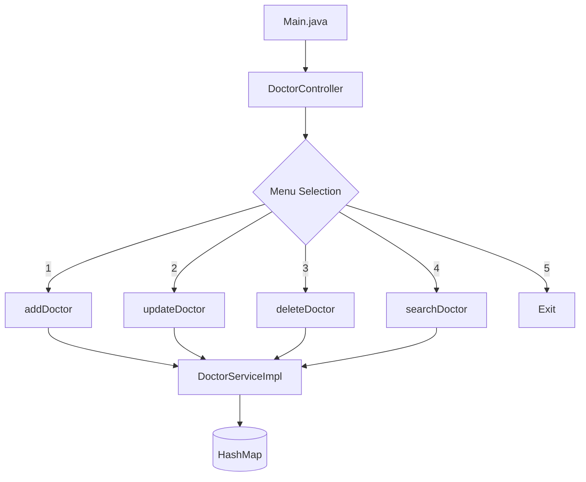
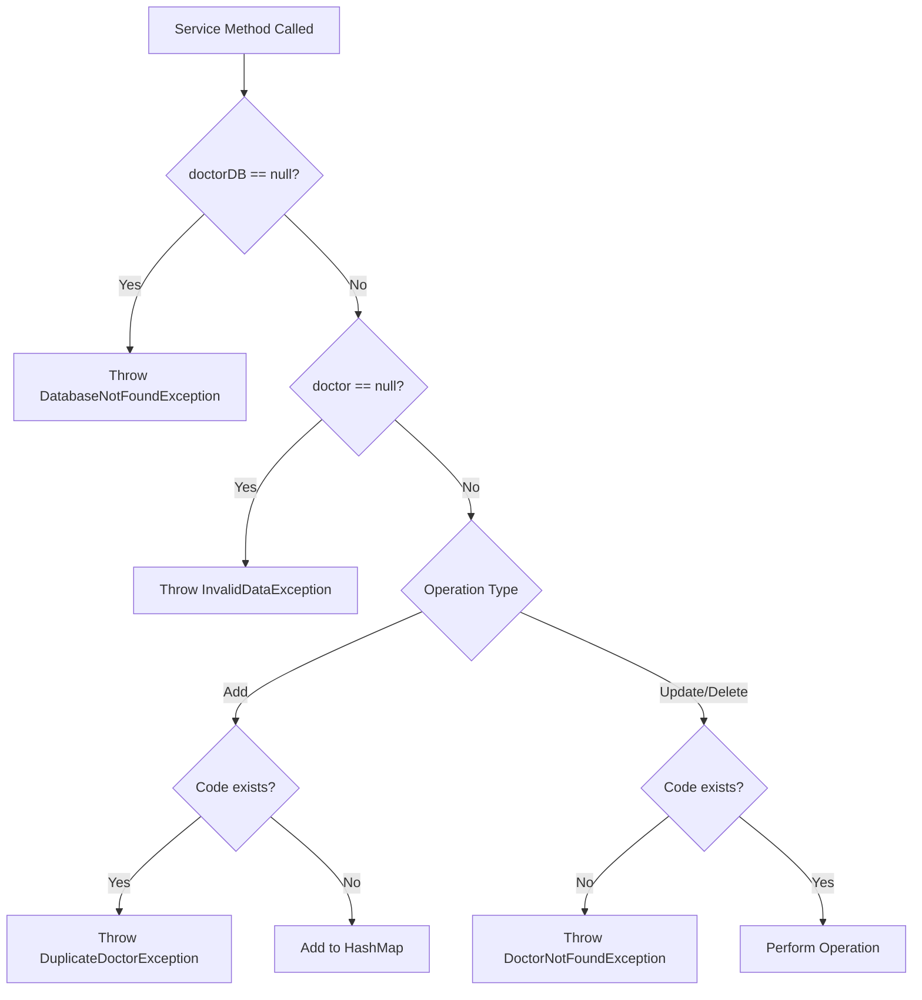

# J1.S.P0055 - Doctor Management Program

## Hướng Dẫn Chi Tiết Luồng Hoạt Động

---

## 📁 Cấu Trúc Project

```
J1.S.P0055_Doctor/
├── src/
│   ├── Main.java                          # Entry point
│   ├── constants/
│   │   └── Messages.java                  # Tất cả string hiển thị
│   ├── controller/
│   │   └── DoctorController.java          # Xử lý luồng chương trình
│   ├── dto/
│   │   └── DoctorDTO.java                 # Data Transfer Object
│   ├── exception/
│   │   ├── SystemException.java           # Exception cha
│   │   ├── DatabaseNotFoundException.java # HashMap null
│   │   ├── DoctorNotFoundException.java   # Không tìm thấy code
│   │   ├── DuplicateDoctorException.java  # Code bị trùng
│   │   └── InvalidDataException.java      # Dữ liệu không hợp lệ
│   ├── model/
│   │   └── Doctor.java                    # Entity chính
│   ├── service/
│   │   ├── DoctorService.java             # Interface
│   │   └── DoctorServiceImpl.java         # Triển khai HashMap
│   └── util/
│       └── Validator.java                 # Validate input
├── nbproject/
├── build.xml
└── manifest.mf
```

---

## 🔄 Luồng Hoạt Động Chính



---

## 📋 Chi Tiết Từng Chức Năng

### 1️⃣ Add Doctor (Thêm Bác Sĩ)

**Luồng xử lý:**

```
┌─────────────────────────────────────────────────────────────┐
│ User chọn option 1                                          │
└─────────────────────────────────────────────────────────────┘
                            ↓
┌─────────────────────────────────────────────────────────────┐
│ Controller: Hiển thị form nhập                              │
│   - Enter Code: ___                                         │
│   - Enter Name: ___                                         │
│   - Enter Specialization: ___                               │
│   - Enter Availability: ___                                 │
└─────────────────────────────────────────────────────────────┘
                            ↓
┌─────────────────────────────────────────────────────────────┐
│ Validator: Kiểm tra input                                   │
│   - Code: không được rỗng                                   │
│   - Name: không được rỗng                                   │
│   - Specialization: không được rỗng                         │
│   - Availability: >= 0                                      │
└─────────────────────────────────────────────────────────────┘
                            ↓
┌─────────────────────────────────────────────────────────────┐
│ Service: addDoctor(doctor)                                  │
│   1. Kiểm tra doctorDB != null                              │
│   2. Kiểm tra doctor != null                                │
│   3. Kiểm tra code không bị trùng                           │
│   4. Put vào HashMap                                        │
└─────────────────────────────────────────────────────────────┘
                            ↓
┌─────────────────────────────────────────────────────────────┐
│ ✅ Thành công: "Doctor added successfully!"                  │
│ ❌ Lỗi: Hiển thị exception message                           │
└─────────────────────────────────────────────────────────────┘
```

**Code flow:**
```java
// Controller
String code = Validator.getString(Messages.PROMPT_CODE);
String name = Validator.getString(Messages.PROMPT_NAME);
...
Doctor doctor = new Doctor(code, name, specialization, availability);
service.addDoctor(doctor);

// Service
if (doctorDB.containsKey(doctor.getCode())) {
    throw new DuplicateDoctorException(doctor.getCode());
}
doctorDB.put(doctor.getCode(), doctor);
```

---

### 2️⃣ Update Doctor (Cập Nhật Bác Sĩ)

**Luồng xử lý:**

```
┌─────────────────────────────────────────────────────────────┐
│ User chọn option 2                                          │
└─────────────────────────────────────────────────────────────┘
                            ↓
┌─────────────────────────────────────────────────────────────┐
│ Controller: Nhập Code cần update                            │
│   - Enter Code: ___                                         │
└─────────────────────────────────────────────────────────────┘
                            ↓
┌─────────────────────────────────────────────────────────────┐
│ Controller: Nhập thông tin mới (để trống = giữ nguyên)      │
│   - Enter Name: ___ (blank = keep old)                      │
│   - Enter Specialization: ___ (blank = keep old)            │
│   - Enter Availability: ___ (blank = keep old)              │
└─────────────────────────────────────────────────────────────┘
                            ↓
┌─────────────────────────────────────────────────────────────┐
│ Service: updateDoctor(doctor)                               │
│   1. Kiểm tra doctorDB != null                              │
│   2. Kiểm tra doctor != null                                │
│   3. Kiểm tra code TỒN TẠI trong DB                         │
│   4. Lấy doctor cũ, cập nhật chỉ các field không rỗng       │
│   5. Put lại vào HashMap                                    │
└─────────────────────────────────────────────────────────────┘
                            ↓
┌─────────────────────────────────────────────────────────────┐
│ ✅ Thành công: "Doctor updated successfully!"                │
│ ❌ Lỗi: "Doctor code doesn't exist"                          │
└─────────────────────────────────────────────────────────────┘
```

**Code flow:**
```java
// Service
if (!doctorDB.containsKey(doctor.getCode())) {
    throw new DoctorNotFoundException();
}
Doctor existingDoctor = doctorDB.get(doctor.getCode());

if (doctor.getName() != null && !doctor.getName().isEmpty()) {
    existingDoctor.setName(doctor.getName());
}
// ... tương tự cho các field khác
doctorDB.put(doctor.getCode(), existingDoctor);
```

---

### 3️⃣ Delete Doctor (Xóa Bác Sĩ)

**Luồng xử lý:**

```
┌─────────────────────────────────────────────────────────────┐
│ User chọn option 3                                          │
└─────────────────────────────────────────────────────────────┘
                            ↓
┌─────────────────────────────────────────────────────────────┐
│ Controller: Nhập Code cần xóa                               │
│   - Enter Code: ___                                         │
└─────────────────────────────────────────────────────────────┘
                            ↓
┌─────────────────────────────────────────────────────────────┐
│ Controller: Xác nhận xóa                                    │
│   - Are you sure you want to delete? (Y/N): ___             │
└─────────────────────────────────────────────────────────────┘
                            ↓
┌─────────────────────────────────────────────────────────────┐
│ Service: deleteDoctor(doctor)                               │
│   1. Kiểm tra doctorDB != null                              │
│   2. Kiểm tra doctor != null                                │
│   3. Kiểm tra code TỒN TẠI trong DB                         │
│   4. Remove khỏi HashMap                                    │
└─────────────────────────────────────────────────────────────┘
                            ↓
┌─────────────────────────────────────────────────────────────┐
│ ✅ Thành công: "Doctor deleted successfully!"                │
│ ❌ Lỗi: "Doctor code doesn't exist"                          │
└─────────────────────────────────────────────────────────────┘
```

**Code flow:**
```java
// Service
if (!doctorDB.containsKey(doctor.getCode())) {
    throw new DoctorNotFoundException();
}
doctorDB.remove(doctor.getCode());
```

---

### 4️⃣ Search Doctor (Tìm Kiếm Bác Sĩ)

**Luồng xử lý:**

```
┌─────────────────────────────────────────────────────────────┐
│ User chọn option 4                                          │
└─────────────────────────────────────────────────────────────┘
                            ↓
┌─────────────────────────────────────────────────────────────┐
│ Controller: Nhập text tìm kiếm                              │
│   - Enter text: ___                                         │
└─────────────────────────────────────────────────────────────┘
                            ↓
┌─────────────────────────────────────────────────────────────┐
│ Service: searchDoctor(input)                                │
│   1. Kiểm tra doctorDB != null                              │
│   2. Duyệt qua tất cả doctors trong HashMap                 │
│   3. Kiểm tra code/name/specialization contains input       │
│   4. Thêm vào result HashMap                                │
└─────────────────────────────────────────────────────────────┘
                            ↓
┌─────────────────────────────────────────────────────────────┐
│ Controller: Hiển thị kết quả                                │
│   ---------- Result ------------                            │
│   Code    Name      Specialization    Availability          │
│   DOC1    Nghia     Orthopedics       3                     │
│   DOC2    Phuong    Obstetrics        2                     │
└─────────────────────────────────────────────────────────────┘
```

**Code flow:**
```java
// Service
HashMap<String, Doctor> results = new HashMap<>();
for (Doctor doctor : doctorDB.values()) {
    if (doctor.getCode().toLowerCase().contains(input.toLowerCase())
        || doctor.getName().toLowerCase().contains(input.toLowerCase())
        || doctor.getSpecialization().toLowerCase().contains(input.toLowerCase())) {
        results.put(doctor.getCode(), doctor);
    }
}
return results;
```

---

## 🛡️ Exception Hierarchy

```
Exception
    └── SystemException
            ├── DatabaseNotFoundException    ("Database does not exist")
            ├── DuplicateDoctorException     ("Doctor code [X] is duplicate")
            ├── DoctorNotFoundException      ("Doctor code doesn't exist")
            └── InvalidDataException         ("Data doesn't exist")
```

---

## 📊 Luồng Xử Lý Exception



---

## 🎯 Validation Rules

| Field | Rule | Method |
|-------|------|--------|
| Code | Không được null, không được rỗng, không được trùng | `Validator.getString()` |
| Name | Không được rỗng | `Validator.getString()` |
| Specialization | Không được rỗng | `Validator.getString()` |
| Availability | >= 0 | `Validator.getInt()` + `checkAvailability()` |

---

## 🧪 Test Cases

### Add Doctor
| Test | Input | Expected |
|------|-------|----------|
| Valid | Code="DOC1", Name="Nghia", Spec="Orthopedics", Avail=3 | Success |
| Duplicate | Same code again | "Doctor code DOC1 is duplicate" |
| Empty code | Code="" | Re-prompt |

### Update Doctor  
| Test | Input | Expected |
|------|-------|----------|
| Valid | Code="DOC1", Name="New Name" | Success, name updated |
| Not found | Code="INVALID" | "Doctor code doesn't exist" |
| All blank | All fields empty | Keep original values |

### Delete Doctor
| Test | Input | Expected |
|------|-------|----------|
| Valid + Confirm Y | Code="DOC1", Y | Success, doctor removed |
| Valid + Confirm N | Code="DOC1", N | Cancelled |
| Not found | Code="INVALID" | "Doctor code doesn't exist" |

### Search Doctor
| Test | Input | Expected |
|------|-------|----------|
| Partial name | "Ngh" | Returns doctors with "Ngh" in name |
| Specialization | "Ortho" | Returns matching doctors |
| No match | "XYZ" | "No doctors found" |
