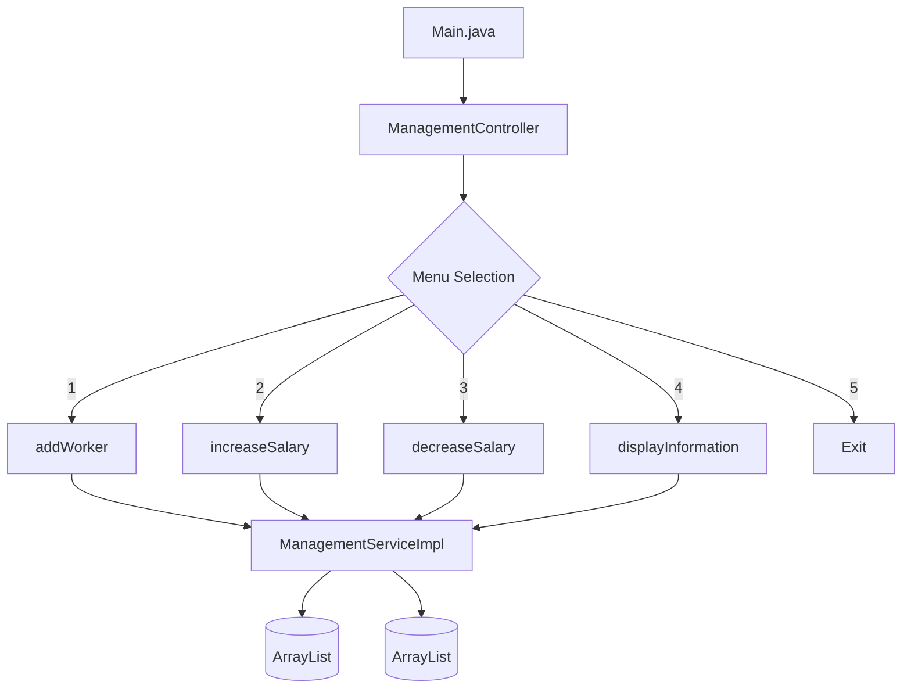
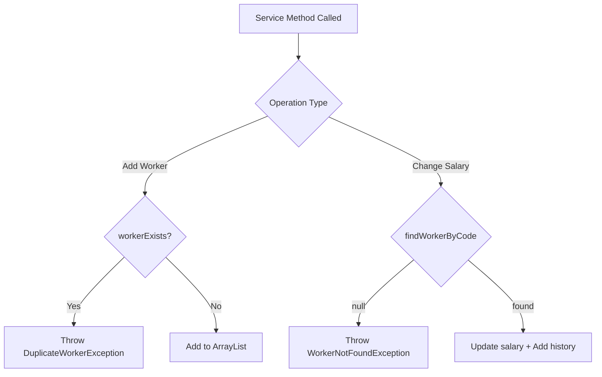

# J1.S.P0056 - Worker Management Program

## Hướng Dẫn Chi Tiết Luồng Hoạt Động

---

## 📁 Cấu Trúc Project

```
J1.S.P0056_Worker/
├── src/
│   ├── Main.java                          # Entry point
│   ├── constants/
│   │   └── Messages.java                  # Tất cả string hiển thị
│   ├── controller/
│   │   └── ManagementController.java      # Xử lý luồng chương trình
│   ├── dto/
│   │   └── WorkerDTO.java                 # Data Transfer Object
│   ├── exception/
│   │   ├── SystemException.java           # Exception cha
│   │   ├── DuplicateWorkerException.java  # Code bị trùng
│   │   └── WorkerNotFoundException.java   # Không tìm thấy code
│   ├── model/
│   │   ├── Worker.java                    # Entity chính
│   │   └── SalaryHistory.java             # Lịch sử lương
│   ├── service/
│   │   ├── ManagementService.java         # Interface
│   │   └── ManagementServiceImpl.java     # Triển khai ArrayList
│   └── util/
│       └── Validator.java                 # Validate input
├── nbproject/
├── build.xml
└── manifest.mf
```

---

## 🔄 Luồng Hoạt Động Chính



---

## 📋 Chi Tiết Từng Chức Năng

### 1️⃣ Add Worker (Thêm Công Nhân)

**Luồng xử lý:**

```
┌─────────────────────────────────────────────────────────────┐
│ User chọn option 1                                          │
└─────────────────────────────────────────────────────────────┘
                            ↓
┌─────────────────────────────────────────────────────────────┐
│ Controller: Hiển thị form nhập                              │
│   - Enter Code: ___                                         │
│   - Enter Name: ___                                         │
│   - Enter Age: ___ (18-50)                                  │
│   - Enter Salary: ___                                       │
│   - Enter Work Location: ___                                │
└─────────────────────────────────────────────────────────────┘
                            ↓
┌─────────────────────────────────────────────────────────────┐
│ Validator: Kiểm tra input                                   │
│   - Code: không được rỗng                                   │
│   - Name: không được rỗng                                   │
│   - Age: 18 <= age <= 50                                    │
│   - Salary: > 0                                             │
│   - Work Location: không được rỗng                          │
└─────────────────────────────────────────────────────────────┘
                            ↓
┌─────────────────────────────────────────────────────────────┐
│ Service: addWorker(worker)                                  │
│   1. Kiểm tra workerExists(code)                            │
│   2. Nếu trùng → throw DuplicateWorkerException             │
│   3. Thêm vào ArrayList workers                             │
└─────────────────────────────────────────────────────────────┘
                            ↓
┌─────────────────────────────────────────────────────────────┐
│ ✅ Thành công: "Worker added successfully!"                  │
│ ❌ Lỗi: Hiển thị exception message                           │
└─────────────────────────────────────────────────────────────┘
```

**Code flow:**
```java
// Controller
String code = Validator.getString(Messages.PROMPT_CODE);
String name = Validator.getString(Messages.PROMPT_NAME);
int age = Validator.getInt(Messages.PROMPT_AGE, 18, 50);
double salary = Validator.getDouble(Messages.PROMPT_SALARY, 0, Double.MAX_VALUE);
String workLocation = Validator.getString(Messages.PROMPT_WORK_LOCATION);

Worker worker = new Worker(code, name, age, salary, workLocation);
service.addWorker(worker);

// Service
if (workerExists(worker.getCode())) {
    throw new DuplicateWorkerException(worker.getCode());
}
workers.add(worker);
```

---

### 2️⃣ Up Salary (Tăng Lương)

**Luồng xử lý:**

```
┌─────────────────────────────────────────────────────────────┐
│ User chọn option 2                                          │
└─────────────────────────────────────────────────────────────┘
                            ↓
┌─────────────────────────────────────────────────────────────┐
│ Controller: Nhập thông tin                                  │
│   - Enter Code: ___                                         │
│   - Enter Salary amount: ___                                │
└─────────────────────────────────────────────────────────────┘
                            ↓
┌─────────────────────────────────────────────────────────────┐
│ Service: changeSalary(code, amount, isIncrease=true)        │
│   1. Tìm worker theo code                                   │
│   2. Nếu không tìm thấy → throw WorkerNotFoundException     │
│   3. worker.salary = worker.salary + amount                 │
│   4. Tạo SalaryHistory với status "UP"                      │
│   5. Thêm vào salaryHistories                               │
└─────────────────────────────────────────────────────────────┘
                            ↓
┌─────────────────────────────────────────────────────────────┐
│ ✅ Thành công: "Salary increased successfully!"              │
│ ❌ Lỗi: "Worker with code 'X' does not exist"                │
└─────────────────────────────────────────────────────────────┘
```

**Code flow:**
```java
// Service
Worker worker = findWorkerByCode(code);
if (worker == null) {
    throw new WorkerNotFoundException(code);
}

worker.setSalary(worker.getSalary() + amount);

SalaryHistory history = new SalaryHistory(
    worker.getCode(),
    worker.getName(),
    worker.getAge(),
    worker.getSalary(),
    "UP"
);
salaryHistories.add(history);
```

---

### 3️⃣ Down Salary (Giảm Lương)

**Luồng xử lý:**

```
┌─────────────────────────────────────────────────────────────┐
│ User chọn option 3                                          │
└─────────────────────────────────────────────────────────────┘
                            ↓
┌─────────────────────────────────────────────────────────────┐
│ Controller: Nhập thông tin                                  │
│   - Enter Code: ___                                         │
│   - Enter Salary amount: ___                                │
└─────────────────────────────────────────────────────────────┘
                            ↓
┌─────────────────────────────────────────────────────────────┐
│ Service: changeSalary(code, amount, isIncrease=false)       │
│   1. Tìm worker theo code                                   │
│   2. Nếu không tìm thấy → throw WorkerNotFoundException     │
│   3. worker.salary = worker.salary - amount                 │
│   4. Tạo SalaryHistory với status "DOWN"                    │
│   5. Thêm vào salaryHistories                               │
└─────────────────────────────────────────────────────────────┘
                            ↓
┌─────────────────────────────────────────────────────────────┐
│ ✅ Thành công: "Salary decreased successfully!"              │
│ ❌ Lỗi: "Worker with code 'X' does not exist"                │
└─────────────────────────────────────────────────────────────┘
```

**Code flow:**
```java
// Service
Worker worker = findWorkerByCode(code);
if (worker == null) {
    throw new WorkerNotFoundException(code);
}

worker.setSalary(worker.getSalary() - amount);

SalaryHistory history = new SalaryHistory(
    worker.getCode(),
    worker.getName(),
    worker.getAge(),
    worker.getSalary(),
    "DOWN"
);
salaryHistories.add(history);
```

---

### 4️⃣ Display Information Salary (Hiển Thị Lịch Sử Lương)

**Luồng xử lý:**

```
┌─────────────────────────────────────────────────────────────┐
│ User chọn option 4                                          │
└─────────────────────────────────────────────────────────────┘
                            ↓
┌─────────────────────────────────────────────────────────────┐
│ Service: getInformationSalary()                             │
│   1. Kiểm tra salaryHistories.isEmpty()                     │
│   2. Nếu trống → "No salary history available."             │
│   3. Duyệt qua và hiển thị từng SalaryHistory               │
└─────────────────────────────────────────────────────────────┘
                            ↓
┌─────────────────────────────────────────────────────────────┐
│ Output:                                                     │
│   DISPLAY INFORMATION SALARY                                │
│   Code    Name      Age   Salary    Status    Date          │
│   W001    John      25    5500.0    UP        2024-01-07    │
│   W001    John      25    5000.0    DOWN      2024-01-07    │
└─────────────────────────────────────────────────────────────┘
```

**Code flow:**
```java
// Service
if (salaryHistories.isEmpty()) {
    System.out.println("No salary history available.");
    return;
}

System.out.println(Messages.TABLE_HEADER);
for (SalaryHistory history : salaryHistories) {
    System.out.println(history);
}
```

---

## 🛡️ Exception Hierarchy

```
Exception
    └── SystemException
            ├── DuplicateWorkerException    ("Worker with code 'X' already exists")
            └── WorkerNotFoundException     ("Worker with code 'X' does not exist")
```

---

## 📊 Luồng Xử Lý Exception



---

## 🎯 Validation Rules

| Field | Rule | Method |
|-------|------|--------|
| Code | Không được rỗng, không được trùng | `Validator.getString()` |
| Name | Không được rỗng | `Validator.getString()` |
| Age | 18 <= age <= 50 | `Validator.getInt(prompt, 18, 50)` |
| Salary | > 0 | `Validator.getDouble()` |
| Work Location | Không được rỗng | `Validator.getString()` |
| Amount | > 0 | `Validator.getDouble()` |

---

## 🗂️ Data Models

### Worker
```java
public class Worker {
    private String code;
    private String name;
    private int age;
    private double salary;
    private String workLocation;
}
```

### SalaryHistory
```java
public class SalaryHistory {
    private String code;
    private String name;
    private int age;
    private double salary;
    private String status;  // "UP" or "DOWN"
    private Date date;      // Tự động lấy thời điểm hiện tại
}
```

---

## 📈 So Sánh Với J1.S.P0055_Doctor

| Feature | J1.S.P0055 (Doctor) | J1.S.P0056 (Worker) |
|---------|---------------------|---------------------|
| Data Storage | HashMap<String, Doctor> | ArrayList<Worker> |
| Operations | CRUD (Add, Update, Delete, Search) | Add, Up/Down Salary, Display History |
| History Tracking | Không | Có (SalaryHistory) |
| Search | Có (by code/name/spec) | Không |
| Update | Có | Không trực tiếp |
| Delete | Có | Không |

---

## 🧪 Test Cases

### Add Worker
| Test | Input | Expected |
|------|-------|----------|
| Valid | Code="W001", Name="John", Age=25, Salary=5000, Loc="HN" | Success |
| Duplicate | Same code again | "Worker with code 'W001' already exists" |
| Age < 18 | Age=16 | Re-prompt |
| Age > 50 | Age=55 | Re-prompt |

### Up Salary
| Test | Input | Expected |
|------|-------|----------|
| Valid | Code="W001", Amount=500 | Salary: 5000 → 5500, History added |
| Not found | Code="INVALID" | "Worker with code 'INVALID' does not exist" |

### Down Salary
| Test | Input | Expected |
|------|-------|----------|
| Valid | Code="W001", Amount=500 | Salary: 5500 → 5000, History added |
| Not found | Code="INVALID" | "Worker with code 'INVALID' does not exist" |

### Display Information
| Test | Condition | Expected |
|------|-----------|----------|
| Has history | After Up/Down operations | Show table with all history |
| No history | No salary changes made | "No salary history available." |
